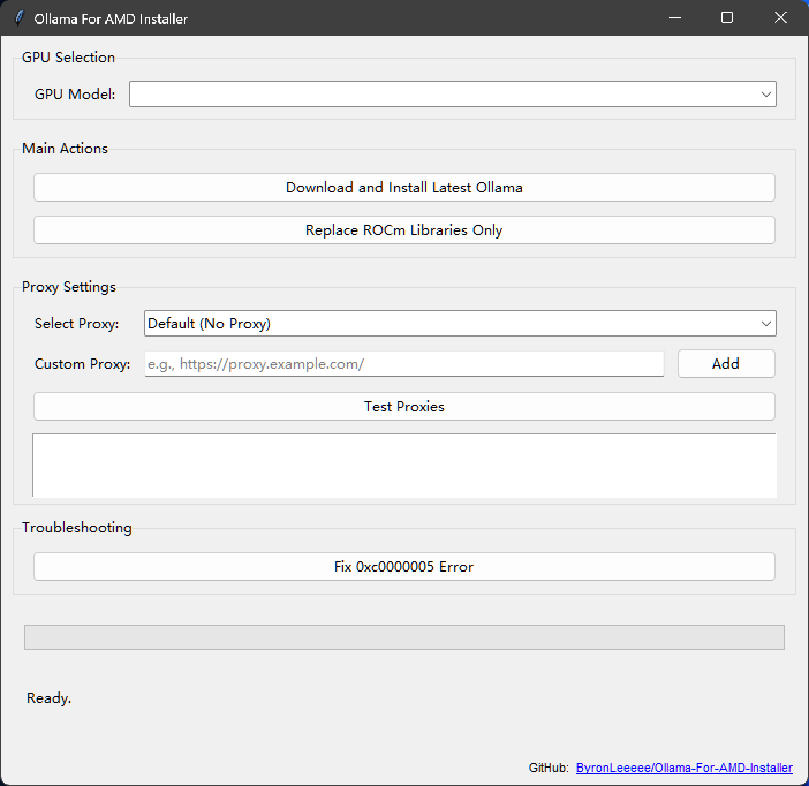

# Ollama-For-AMD-Installer

## Overview
This tool simplifies the installation and management of the community-driven [ollama-for-amd library](https://github.com/likelovewant/ollama-for-amd), created by [likelovewant](https://github.com/likelovewant/). It provides a user-friendly graphical interface to help users keep their AMD GPU-compatible Ollama installations up-to-date and properly configured.

## Screenshot


## Features

- **Automated Installation**: Checks for the latest Ollama for AMD release and installs it.
- **Simple ROCm Updates**: Downloads and replaces ROCm libraries with versions optimized for your specific GPU.
- **Flexible Path Detection**: Automatically finds your Ollama installation, even if it's in a non-default directory. If it can't be found, it will ask you to locate it manually.
- **One-Click Error Fix**: Includes a simple fix for the common `0xc0000005` runtime error.
- **Proxy Support**: Built-in support for multiple proxy servers to assist users with network restrictions.

## Installation

### Option 1: Download the Executable
The easiest way to get started is to download the latest `Ollama-For-AMD-Installer.exe` from the [**Releases Page**](https://github.com/ByronLeeeee/Ollama-For-AMD-Installer/releases).

### Option 2: Build from Source
1.  **Clone the repository:**
    ```bash
    git clone https://github.com/ByronLeeeee/Ollama-For-AMD-Installer.git
    cd Ollama-For-AMD-Installer
    ```

2.  **Install dependencies:**
    ```bash
    pip install -r requirements.txt
    ```   
   *Prerequisites: Python 3.10 or higher.*

## How to Use

1.  **Run the application with administrator privileges.** This is required to modify files in the Ollama installation directory.
2.  **Select Your GPU**: Choose your AMD GPU model from the dropdown menu. The list includes descriptions (e.g., "Ryzen 7040/8040 'Phoenix'") to help you find the right one.
3.  **Choose an Action**:
    *   **Download and Install Latest Ollama**: Performs a full installation, including the base application and the correct ROCm libraries for your selected GPU.
    *   **Replace ROCm Libraries Only**: Updates only the GPU-specific libraries. Use this if you already have Ollama installed.
    *   **Fix 0xc0000005 Error**: Applies a known fix if you encounter this specific runtime error.
4.  **Proxy Settings (Optional)**: If you have trouble connecting to GitHub, use the proxy settings to test and select a faster mirror.

## A Note from the Author

Thank you all for your incredible support! I am committed to maintaining this project to the best of my ability.

However, I have recently upgraded my primary desktop PC to an NVIDIA RTX 5070 Ti ( It's awesome :D ). This means I can no longer personally test the installer on a dedicated AMD graphics card. My development and testing will now rely on the official documentation from the `ollama-for-amd` repository and my laptop, which runs a **6800H APU with 680M graphics (gfx1036)**. While this allows me to validate functionality for many APU users, I appreciate your understanding and welcome community feedback, especially for dGPU-related issues.

## Contributing
Contributions are always welcome! Please feel free to open an issue or submit a pull request to:
- Report bugs or suggest improvements.
- Request new features.
- Enhance the documentation.

## License
This project is licensed under the MIT License. See the [LICENSE](LICENSE) file for details.